# MULTIAGENT SYSTEMS

## CrewAI ile Drone Flight Checklist App

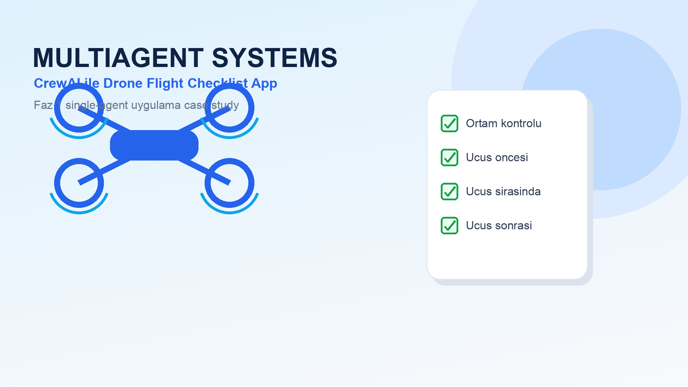

---

# Sunum Akisi

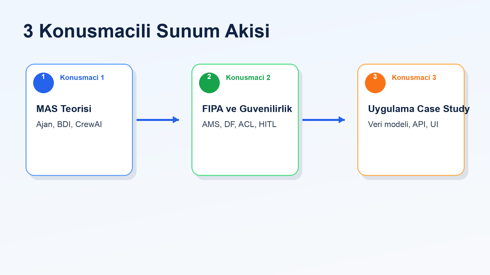

| Konusmaci | Bolum | Odak |
| --- | --- | --- |
| 1 | MAS teorisi ve CrewAI | Ajan, BDI, process |
| 2 | FIPA ve guvenilirlik | AMS, DF, ACL, memory, HITL |
| 3 | Uygulama case study | Drone checklist app, veri modeli, API, sonuc |

---

# Konusmaci 1

## MAS Teorisi ve CrewAI Mimarisi

Bu bolumde:

- ajan kavrami
- BDI modeli
- CrewAI yapi taslari
- process yonetimi

---

# Ajan Kavrami

Wooldridge'e gore ajan, cevresiyle etkilesen ve hedef odakli davranan otonom bir yazilim birimidir.

- Ozerklik: kendi kararlarini verir
- Sosyal yetenek: diger ajanlarla iletisim kurabilir
- Reaktiflik: cevresel degisime tepki verir
- Proaktiflik: hedefe ulasmak icin inisiyatif alir

---

# BDI Modeli

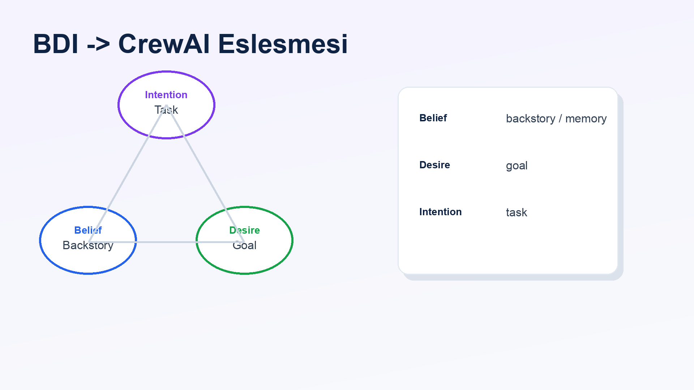

| BDI | Anlam | CrewAI karsiligi |
| --- | --- | --- |
| Belief | Ajanin bildikleri | `backstory`, `memory` |
| Desire | Ulasilmak istenen hedef | `goal` |
| Intention | Secilen eylem plani | `task` |

---

# CrewAI Agent Ornegi

```python
Agent(
    role="Full-Stack Developer",
    goal="Produce a runnable drone flight checklist app",
    backstory="Pragmatic engineer who ships small usable products",
)
```

Bu tanimda:

- `role`: ajanin uzmanligi
- `goal`: uretilecek sonuc
- `backstory`: davranis tarzi ve baglam

---

# CrewAI Yapi Taslari

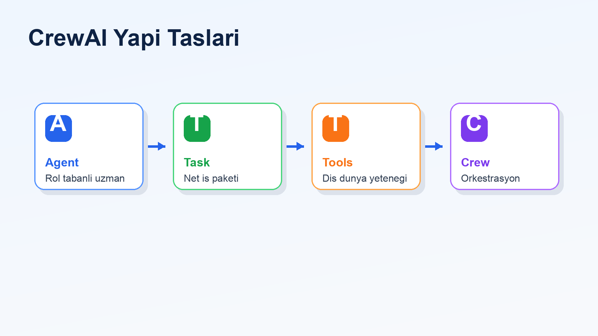

- `Agents`: rol tabanli uzmanlar
- `Tasks`: tanimli is paketleri
- `Tools`: dis dunya ile temas noktasi
- `Crew`: agent ve task akisini yoneten orkestra

---

# Process Yonetimi

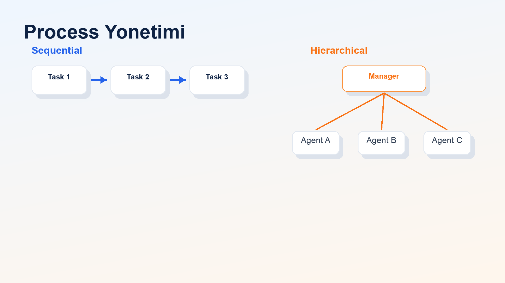

Sequential:

- task'lar sirayla calisir
- onceki cikti sonraki adima aktarilir
- Faz 1 icin kontrollu ve sade yontemdir

Hierarchical:

- manager agent is dagitimi yapar
- daha esnek ama daha karmasiktir

---

# Konusmaci 2

## FIPA, Hafiza ve Guvenilirlik

Bu bolumde:

- FIPA standartlari
- AMS ve DF kavramlari
- FIPA ACL ile CrewAI context benzetmesi
- memory, retry ve human-in-the-loop

---

# FIPA Nedir?

FIPA, ajan sistemleri icin ortak standart ve kavramsal sozluk sunar.

- ajanlarin kimlik ve yasam dongusu
- ajan yeteneklerinin tanitimi
- ajanlar arasi mesajlasma
- hata ve basarisizlik durumlarinin ifade edilmesi

CrewAI bu fikirleri pratik bir agent/task/tool modeline tasir.

---

# FIPA -> CrewAI Karsiliklari

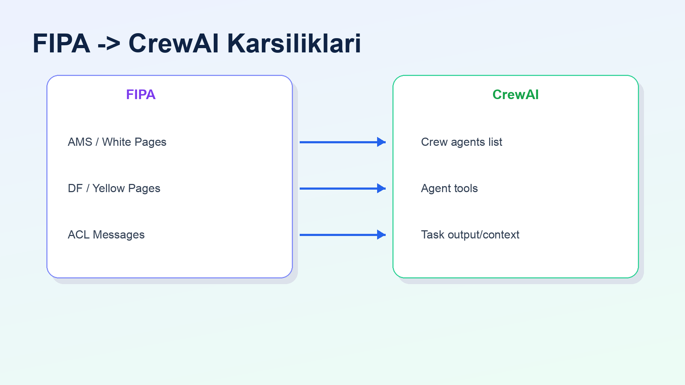

| FIPA kavrami | CrewAI karsiligi |
| --- | --- |
| AMS / White Pages | `Crew(agents=[...])` |
| DF / Yellow Pages | `Agent(tools=[...])` |
| ACL mesajlari | Task output ve context akisi |

---

# FIPA ACL ve CrewAI Context

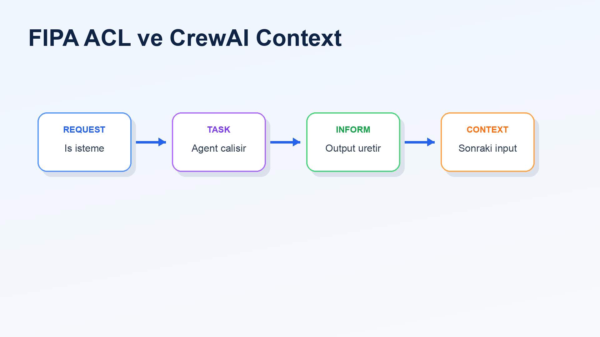

Temel speech act fikirleri:

- `REQUEST`: bir is isteme
- `INFORM`: bilgi aktarma
- `REFUSE`: isi yapamama
- `FAILURE`: basarisiz deneme

CrewAI'de task ciktisi, baska bir task icin context olabilir.

---

# Memory Sistemleri

Short-term memory:

- gorev sirasindaki baglami korur
- o oturumdaki bilgileri kullanir

Long-term memory:

- onceki deneyimlerden yararlanmayi hedefler
- RAG ve vector database yaklasimlariyla iliskilidir

```python
Crew(memory=True)
```

---

# Retry ve Human-in-the-Loop

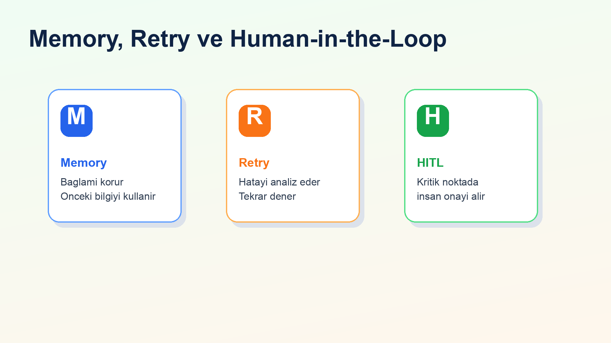

- Retry: hata durumunda farkli stratejiyle tekrar deneme
- Self-correction: hatayi okuyup davranisi duzeltme
- Human-in-the-loop: kritik kararlarda insan onayi alma

```python
Agent(max_retry_limit=3)
Task(human_input=True)
```

---

# Konusmaci 3

## Uygulama Case Study

Bu bolumde:

- mevcut uygulama mimarisi
- drone checklist urun akisi
- session bazli veri modeli
- API ve UI kararlari
- Faz 1 sonucu ve sonraki adim

---

# Faz 1 Uygulama Mimarisi

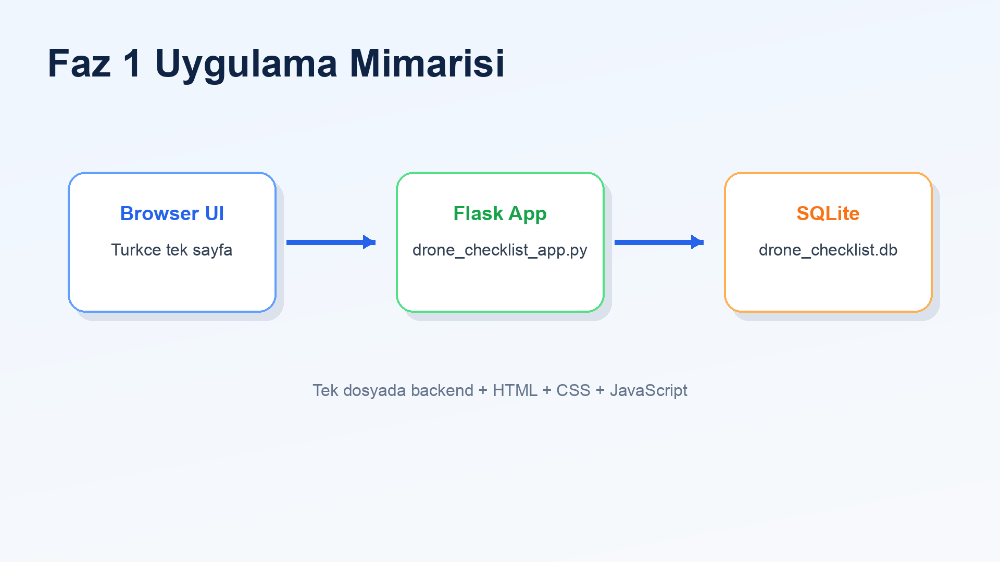

Ana dosya:

- `drone_checklist_app.py`

Tek dosyada:

- Flask backend
- SQLite persistence
- inline HTML/CSS/JavaScript UI

---

# Drone Checklist Urun Akisi

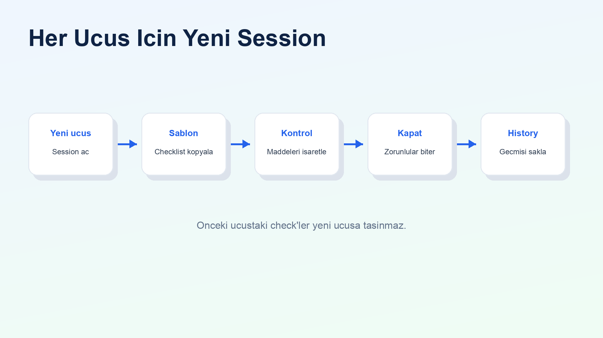

1. Kullanici yeni ucus baslatir
2. Sistem checklist sablonunu oturuma kopyalar
3. Kullanici faz bazli maddeleri tamamlar
4. Acil durum prosedurlerini referans panelinden okur
5. Ucus tamamlaninca oturum kapatilir
6. Gecmis ucuslar saklanir

---

# Checklist Fazlari

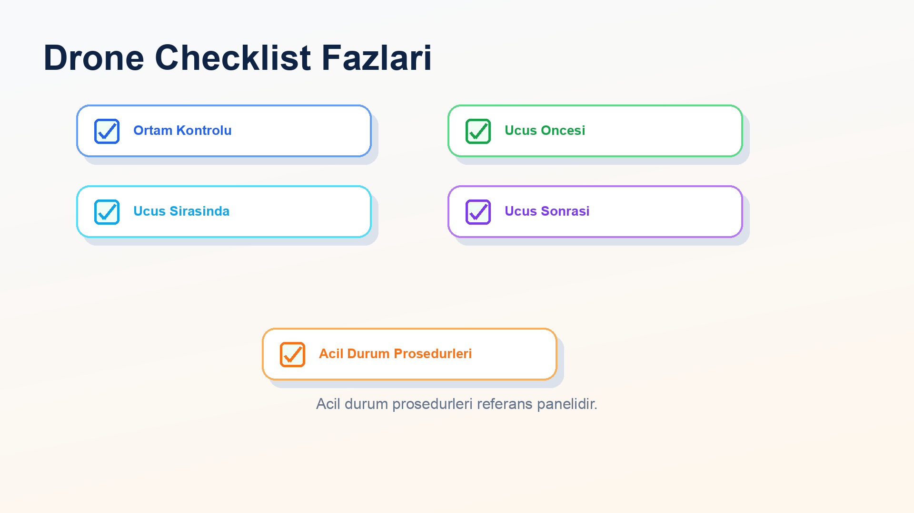

- Ortam Kontrolu
- Ucus Oncesi
- Ucus Sirasinda
- Ucus Sonrasi
- Acil Durum Prosedurleri

Tasarim karari: Acil durum prosedurleri normal checkbox listesi degil, referans panelidir.

---

# Veri Modeli

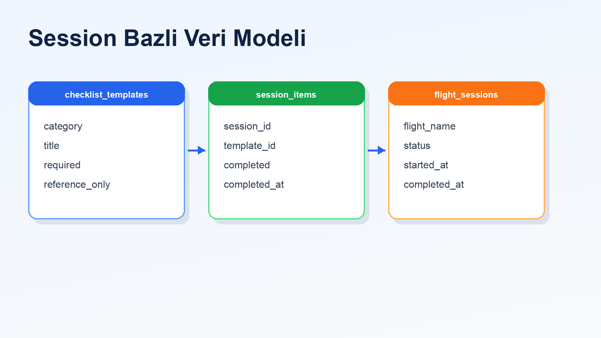

| Tablo | Gorev |
| --- | --- |
| `checklist_templates` | Standart checklist maddelerini saklar |
| `flight_sessions` | Her ucus icin oturum kaydi tutar |
| `session_items` | O ucusa ait tamamlanma durumunu saklar |

---

# Session Mantigi

Drone checklist her ucus icin temiz baslamalidir.

Session modeli sayesinde:

- her ucus ayri takip edilir
- tamamlanma durumu ucusa ozel olur
- gecmis ucuslar korunur
- zorunlu maddeler tamamlanmadan ucus kapatilamaz

---

# API Akisi

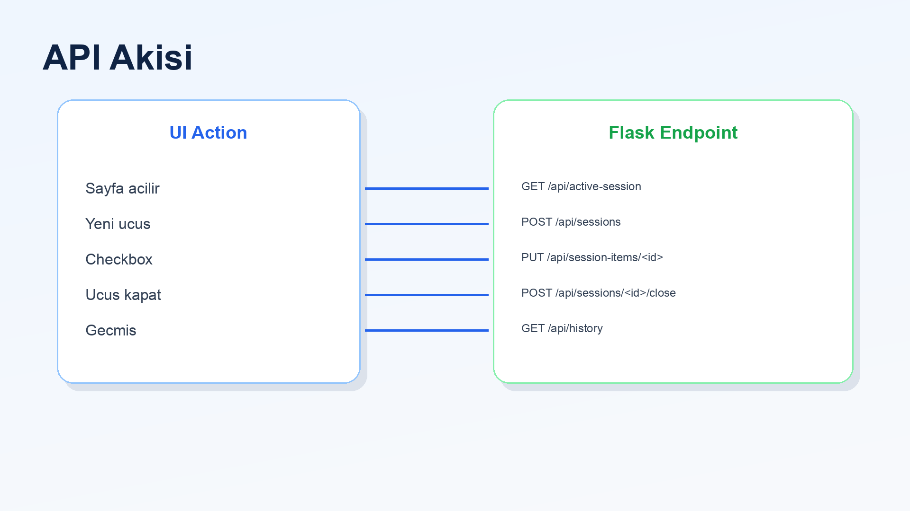

- `GET /api/active-session`
- `POST /api/sessions`
- `GET /api/sessions/<id>/items`
- `PUT /api/session-items/<id>`
- `POST /api/sessions/<id>/close`
- `GET /api/history`
- `GET /api/reference-items`

---

# Basit Turkce UI

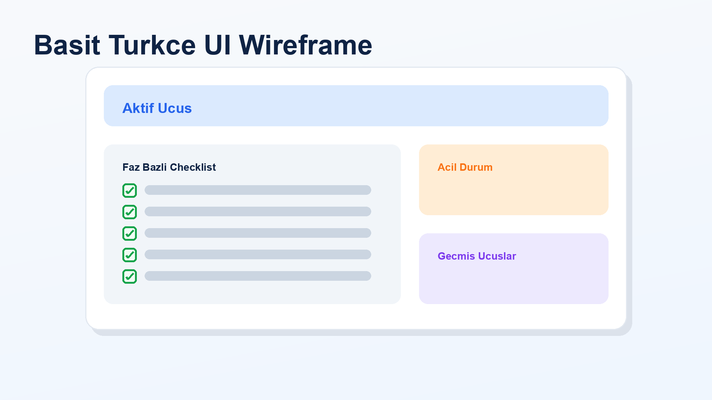

UI bilerek sade tutuldu:

- aktif ucus karti
- yeni ucus baslatma formu
- faz bazli checklist bolumleri
- acil durum referans paneli
- gecmis ucuslar listesi

---

# Dogrulama

Yapilan kontroller:

- Python compile kontrolu
- Flask API smoke test
- yeni session olusturma
- checklist maddesi guncelleme
- zorunlu maddeler bitmeden ucus kapatma engeli
- history endpoint kontrolu

Not: `uv run` bu makinede `onnxruntime` platform uyumsuzlugu nedeniyle takildi.

---

# Faz 1 Ciktilari

- `drone_checklist_app.py`
- `drone_checklist.db`
- `PHASE1_DRONE_CHECKLIST_PLAN.md`
- `README.md`
- `CREWAI sunum.md`
- `CREWAI sunum.html`
- `CREWAI sunum konusmaci notlari.md`
- `assets/` altindaki PNG gorselleri

---

# Sonraki Adim

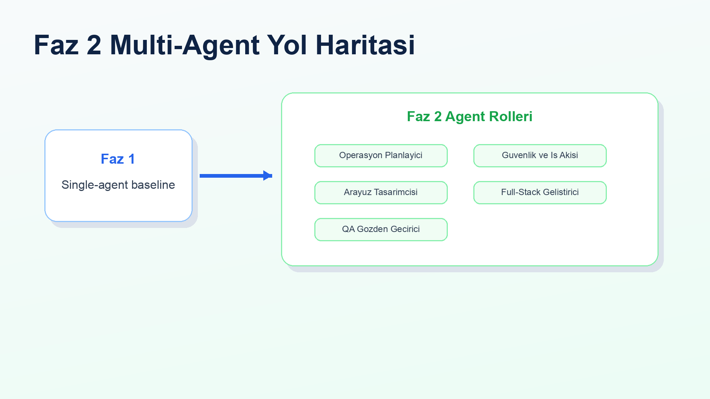

Faz 2'de ayni urun multi-agent yapiya bolunebilir:

- Operasyon Planlayici
- Guvenlik ve Is Akisi Tasarimcisi
- Arayuz Tasarimcisi
- Full-Stack Gelistirici
- QA Gozden Gecirici

---

# Kapanis

Bu calismada:

- MAS teorisi CrewAI kavramlariyla eslestirildi
- FIPA standartlari pratik agent/task yapisina baglandi
- single-agent Faz 1 uygulamasi olusturuldu
- drone checklist icin session bazli veri modeli kuruldu
- sonraki multi-agent faz icin saglam referans cikti hazirlandi

---

# Referanslar

- Wooldridge, M. *An Introduction to MultiAgent Systems*
- FIPA standartlari: `http://www.fipa.org/`
- CrewAI dokumantasyonu: `https://docs.crewai.com/`
- Proje repository'si: yerel CrewAI uygulama repository'si
