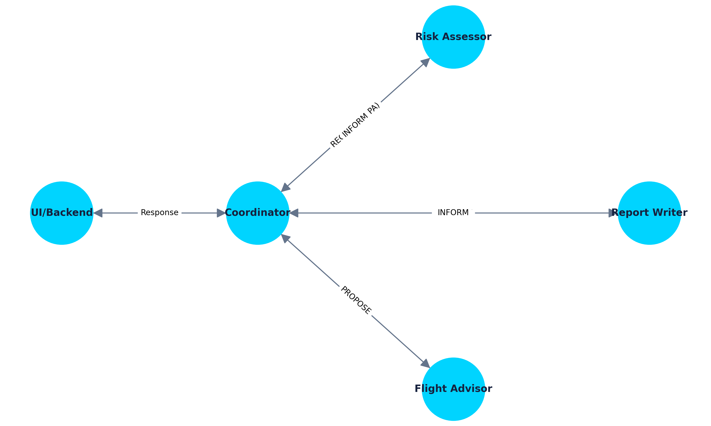
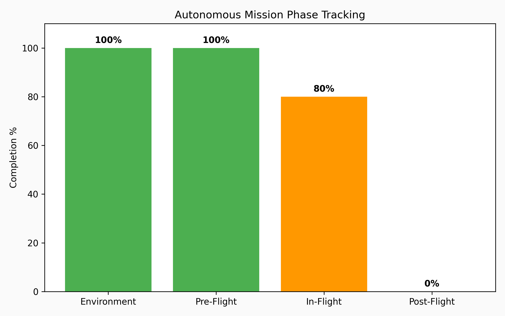

<!-- _class: title -->

# Otonom İHA Kontrolünde Çoklu Ajan Sistemleri (MAS)
## FIPA Standartları ve CrewAI Entegrasyonu

---

# 1. Problem ve Motivasyon

Endüstriyel insansız hava aracı (İHA) operasyonlarında manuel kontrol ve karar alma süreçleri çeşitli zorluklar barındırır:

- **Karmaşık Karar Alma:** Çevresel veriler, batarya durumu ve risk analizlerinin eş zamanlı değerlendirilmesi.
- **İletişim Gecikmeleri:** Anlık olaylara (örn. rüzgar artışı) operatörün tepki süresi.
- **Güvenlik İhlalleri:** Checklist maddelerinin gözden kaçırılması veya eksik tamamlanması.

**Çözüm:** Görevleri izole ajanlara dağıtan ve FIPA-ACL (Agent Communication Language) standartlarıyla haberleşen bir Çoklu Ajan Sistemi (MAS).

---

# 2. Çoklu Ajan Sistemleri (MAS) Yaklaşımı

Sistemimiz tek bir monolitik zeka yerine, özelleşmiş yeteneklere sahip ajanların işbirliği yaptığı bir yapıdadır:

- **Koordinatör (Coordinator):** Görev akışını yönetir, ajanları tetikler [1].
- **Risk Analisti (Risk Assessor):** Hava durumu ve batarya gibi parametrelerden risk skoru üretir.
- **Uçuş Danışmanı (Flight Advisor):** Karşılaşılan blokajlara göre dinamik uçuş manevraları önerir.
- **Raporlayıcı (Report Writer):** Görev bitiminde otonom kayıt ve log oluşturur.

---

# 3. FIPA-ACL Standartları ile İletişim

Ajanların otonomluğu, yapılandırılmış bir iletişim dili ile mümkündür. FIPA (Foundation for Intelligent Physical Agents) standartları kullanılarak geliştirilmiştir.

- **REQUEST:** Koordinatör, Risk Analistinden analiz talep eder.
- **INFORM:** Analist, risk skorunu `LOW/HIGH` olarak bildirir.
- **PROPOSE:** Danışman, uçuş rotasında değişiklik önerir.
- **ACCEPT_PROPOSAL:** Koordinatör, güvenlik kuralları çerçevesinde öneriyi onaylar.

---

# 4. Mimari Akış ve Karar Süreci

---

# 5. Görev Fazları ve Otonom Takip

Uçuş öncesi, uçuş sırası ve sonrası gibi kritik fazlar, ajanlar tarafından gerçek zamanlı değerlendirilir.

---

# 6. Sonuç ve Değerlendirme

- **Modülerlik:** CrewAI altyapısı sayesinde yeni ajanlar (örn. Görüntü İşleme Ajanı) sisteme kolayca eklenebilir.
- **Hız ve Güvenlik:** İnsan faktöründen kaynaklı hatalar minimize edilerek uçuş güvenliği maksimize edilmiştir.
- **Standardizasyon:** FIPA-ACL kullanımı sayesinde diğer Endüstri 4.0 sistemleriyle entegrasyon altyapısı hazırdır [2].

---

# Referanslar

[1] M. Wooldridge, "An Introduction to MultiAgent Systems", John Wiley & Sons, 2009.
[2] FIPA, "FIPA ACL Message Structure Specification", Foundation for Intelligent Physical Agents, SC00061G, 2002.
